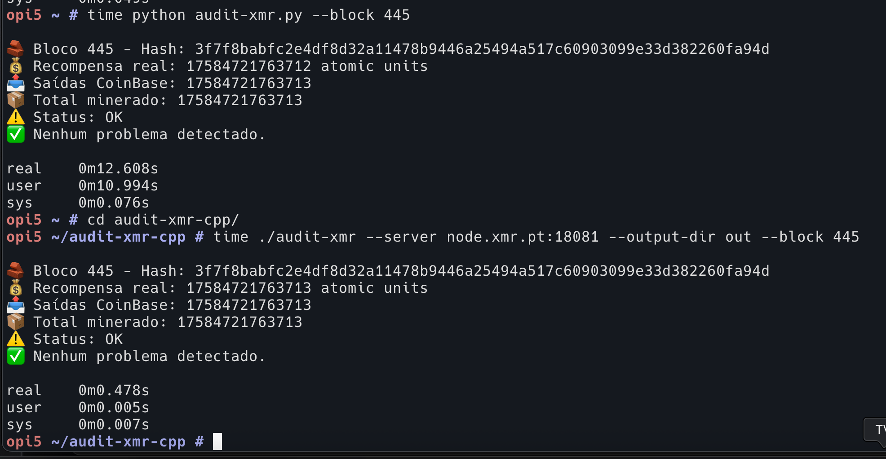
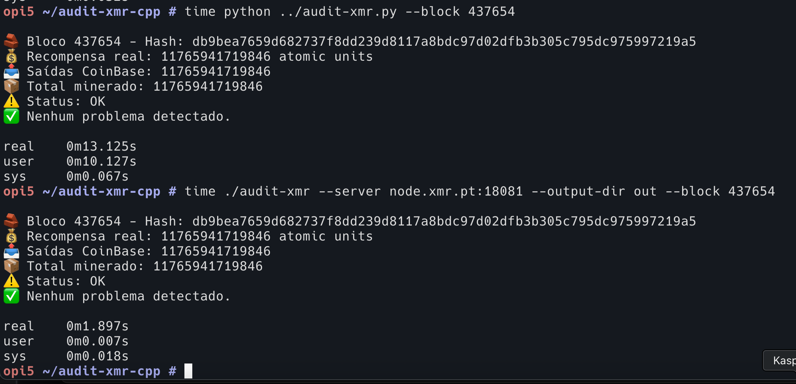

# Audit-XMR

`Audit-XMR` é uma ferramenta para auditar blocos da blockchain Monero, verificando a consistência entre recompensas de bloco, saídas Coinbase e total minerado. Este repositório contém duas implementações: uma em **C++** para desempenho em auditorias multi-threaded e outra em **Python** para facilidade de uso e depuração.

## Funcionalidades
- Auditoria de blocos individuais ou intervalos de blocos.
- Validação de recompensas de bloco contra saídas Coinbase e transações.
- Suporte a servidores RPC remotos.
- Geração de logs detalhados para depuração.
- Saída em CSV com resultados da auditoria.

## Requisitos

### C++
- Compilador C++17 (ex.: `g++`)
- Bibliotecas: `libcurl` e `pthread`
- Biblioteca JSON: `nlohmann/json` (inclusa no código)

### Python
- Python 3.x
- Bibliotecas: `requests`, `tqdm` (instaláveis via `pip`)

## Instalação

### C++
1. Clone o repositório:
   ```bash
   git clone https://github.com/area31/audit-xmr.git
   cd audit-xmr
   g++ audit-xmr.cpp audit.cpp rpc.cpp -o audit-xmr -std=c++17 -lcurl -lpthread


## Performance do Python vs C++
Abaixo estão os resultados visuais comparando o desempenho das versões Python e C++ ao auditar blocos da blockchain Monero.

- **Tempo de bloco unico (ex.: 445)**
  
  *Legenda*: O C++ com multi-threading é significativamente mais rápido que o Python single-threaded para pequenos intervalos.

- **Tempo de bloco unico (ex.: 437654)**
  
  *Legenda*: O C++ escalona melhor com o aumento do número de blocos, enquanto o Python mostra desempenho linear.

*Nota*: Os tempos podem variar dependendo do hardware, configuração de threads e latência da rede RPC.
